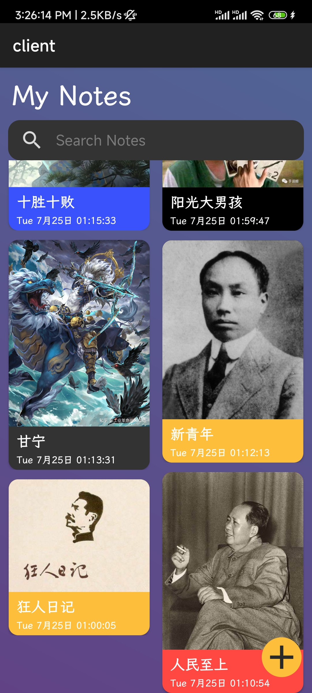
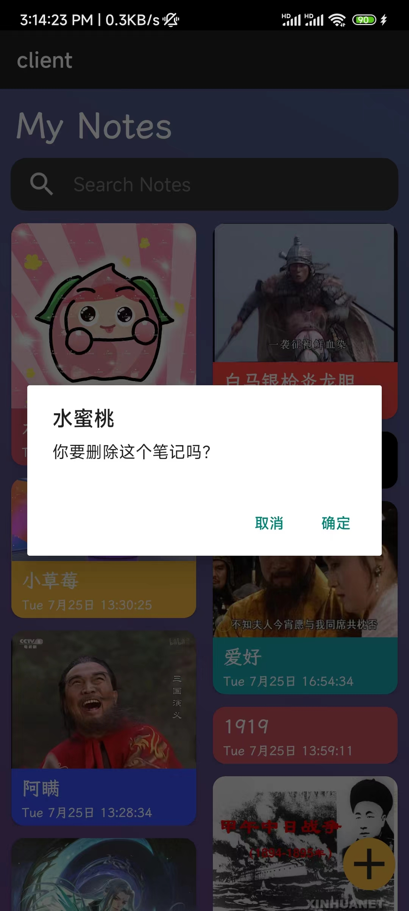
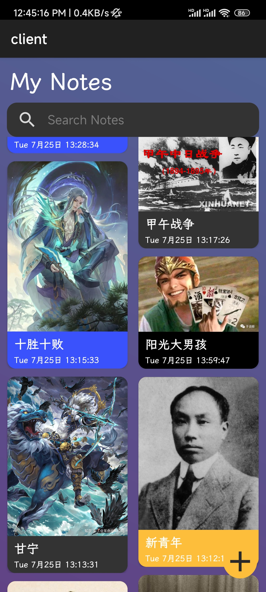

andorid可能由于安卓版本不同需要手动去开启文件读写权限。


### 


### 界面展示


##### 笔记功能

笔记界面采用<b>Instagram</b>风格，进行双列自适应圆角卡片式展示。





笔记删除（长按删除）



 笔记搜索功能
 界面使用网格布局并且可全屏滑动👍，提升用户视觉体验及使用体验。
 搜索功能也是实时查询，不需要用户按下确认才开始搜索👏。


笔记新增/编辑功能
笔记新增和编辑使用同一个`activity`，通过给`Intent`传入`note.id`来判断是否新增。
可以使用系统相册添加图片。
同时提供卡片颜色选择的功能，选择的颜色将在首页笔记列表中体现，同时可以根据标题旁边`span`的颜色来查看当前颜色。
时间也是实时刷新（按秒）的。💯  
整个界面是一个`ScrollView`，不会因为`content`内容太多，使编辑框不好编辑。


## Code
#### Note
##### 双列布局

```java
rvNotes = findViewById(R.id.rv_notes);
noteAdapter = new NoteAdapter(this);
viewModel = new ViewModelProvider(this).get(NotesViewModel.class);
rvNotes.setLayoutManager(new StaggeredGridLayoutManager(2, StaggeredGridLayoutManager.VERTICAL));
rvNotes.setAdapter(noteAdapter);
viewModel.getNotes().observe(this, notes -> {
    noteAdapter.setNotes(notes);
    Log.i(TAG, "onCreate: " + notes);
});
findViewById(R.id.iv_edit).setOnClickListener(v -> startActivity(new Intent(NotesActivity.this, EditNoteActivity.class)));
```
> 使用`StaggeredGridLayoutManager`作为`RecycleView`的布局器，`viewModel`中的数据`LiveData<List<Note>>`是`Room`的查询结果，通过设置`observe()`查询成功时为`Adapter`设置`notes`， 而整个列表显示的是query的结果。初始时`query`列表为所有`Note`

```java
public class NoteAdapter extends RecyclerView.Adapter<NoteAdapter.NoteViewHolder> {

    static class NoteViewHolder extends RecyclerView.ViewHolder { ... }
    
    ...

    private List<Note> notes;
    private List<Note> query;

    @Override
    public void onBindViewHolder(@NonNull NoteViewHolder holder, int position) {
        holder.initNode(context, query.get(position));

    }

    @Override
    public int getItemCount() {
        return query == null ? 0 : query.size();
    }

    public void setNotes(List<Note> notes) {
        this.notes = notes;
        query = new ArrayList<>();
        query.addAll(notes);
        notifyDataSetChanged();
    }

    public void filter(String keyword) {
        if (notes == null || keyword == null) return;
        if (keyword.equals("")) {
            query.clear();
            query.addAll(notes);
        } else {
            query.clear();
            for (Note n : notes) {
                if (n.title.contains(keyword) || n.content.contains(keyword)) {
                    query.add(n);
                }
            }
            new Handler(Looper.getMainLooper()).post(this::notifyDataSetChanged);
        }
    }
}
```
##### 实时监测搜索框


```java

public class NotesActivity extends AppCompatActivity {
    
    @Override
    protected void onCreate(Bundle savedInstanceState) {

        ... 

        inputMethodManager = (InputMethodManager) getSystemService(INPUT_METHOD_SERVICE);

        etKeyword = findViewById(R.id.et_keyword);
        etKeyword.addTextChangedListener(new TextWatcher() {
            @Override
            public void beforeTextChanged(CharSequence charSequence, int i, int i1, int i2) {

            }

            @Override
            public void onTextChanged(CharSequence charSequence, int i, int i1, int i2) {

            }

            @Override
            public void afterTextChanged(Editable editable) {
                listenKey();
            }
        });

        ...

    }

    private String lastKey = "";
    private Thread listenKeyThread;

    private void listenKey() {
        if (listenKeyThread != null && listenKeyThread.isAlive()) return;
        listenKeyThread = new Thread(() -> {
            String key;
            do {
                try {
                    Thread.sleep(1000);
                } catch (InterruptedException e) {
                    throw new RuntimeException(e);
                }
                key = etKeyword.getText().toString().trim();
                if (!key.equals(lastKey)) {
                    noteAdapter.filter(key);
                    lastKey = key;
                }
            } while (inputMethodManager.isActive());
        });
        listenKeyThread.start();

    }

}

```
> 通过实现`TextWatcher`的`afterTextChanged`方法，每次搜索框内容改变时都会调用`listenKey()`方法。`listenKey`方法中，首先判断监测线程是否存在且存活，如果不存在或者已不在存活，新建一个线程，每隔一秒去获取输入框中的内容，并调用`noteAdapter.filter(key)`进行笔记查询。循环直至输入框关闭，线程退出。下次输入框内容变化时，再次创建线程。在输入框内容编辑期间不会持续创建线程，因为上个线程会运行到`inputMethodManager.isActive()`为false为止。

##### 实时时间显示

```java
public class EditNoteActivity extends AppCompatActivity {

    private final static int UPDATE_TIME_WHAT = 0;
    private TextView tvTime;
    private Handler timerHandler;

    @Override
    protected void onCreate(Bundle savedInstanceState) {
        super.onCreate(savedInstanceState);
        setContentView(R.layout.activity_edit_note);

        // ... 

        timerHandler = new Handler(getMainLooper()) {
            @Override
            public void handleMessage(@NonNull Message msg) {
                super.handleMessage(msg);
                switch (msg.what) {
                    case UPDATE_TIME_WHAT:
                        long sysTime = System.currentTimeMillis();
                        CharSequence sysTimeStr = DateFormat.format(getResources().getString(R.string.time_format), sysTime);
                        tvTime.setText(sysTimeStr);
                        break;
                }
            }
        };
        initTimer();

        // ...

    }

    private void initTimer() {
        new Thread() {
            @Override
            public void run() {
                while (true) {
                    try {
                        Message msg = new Message();
                        msg.what = UPDATE_TIME_WHAT;
                        timerHandler.sendMessage(msg);
                        sleep(1000);
                    } catch (InterruptedException e) {
                        throw new RuntimeException(e);
                    }
                }
            }
        }.start();
    }

}
```
定义一个`Handler`，另起一个线程，持续向`timerHandler`发送消息，`timerHandler`收到消息后，更新`TextView`的`text`。

##### 打开相册并获取选取的图片的绝对地址
```java
private void initPhoto() {
    ActivityResultLauncher launcher = registerForActivityResult(new ActivityResultContracts.StartActivityForResult(), result -> {
        if (result.getResultCode() == Activity.RESULT_OK && result.getData() != null) {
            Uri uri = result.getData().getData();
            ivNoteImg.setImageURI(uri);
            layoutImg.setVisibility(View.VISIBLE);
            imgUrl = getPathFromUri(uri);
            Log.i(TAG, "onActivityResult: " + imgUrl + "  /  " + uri.getPath());
        }
    });
    ivPhoto.setOnClickListener(view -> {
        Intent intent = new Intent(Intent.ACTION_PICK, null);
        intent.setType("image/*");
        launcher.launch(intent);
    });
    ivDelete.setOnClickListener(view -> {
        layoutImg.setVisibility(View.GONE);
        imgUrl = null;
    });
}
```

##### 新增编辑共用Activity
```java
public class EditNoteActivity extends AppCompatActivity {

    ...

    private int noteId = 0;

    @Override
    protected void onCreate(Bundle savedInstanceState) {
        super.onCreate(savedInstanceState);
        setContentView(R.layout.activity_edit_note);

        Intent intent = getIntent();
        Bundle bundle = intent.getExtras();
        if (bundle != null)
            noteId = bundle.getLong(INTENT_NOTE_ID_KEY, 0);
        
        ...

        if (noteId != 0) {
            loadNote();
        }
    }

    private void loadNote() {
        AppDatabase.databaseWriteExecutor.execute(() -> {
            Note note = noteDao.selectById(noteId);
            if (note != null) {
                etTitle.setText(note.title);
                etContent.setText(note.content);
                color = note.color;
                btTitleSpan.setBackgroundColor(color);
                layoutImg.setVisibility(View.VISIBLE);
                if (note.imgPath != null && !"".equals(note.imgPath)) {

                    imgUrl = note.imgPath;
                    try {
                        ivNoteImg.setVisibility(View.VISIBLE);
                        String s = URLDecoder.decode(note.imgPath, "UTF-8");
                        Bitmap bm = BitmapFactory.decodeFile(s);

                        timerHandler.post(() -> {
                            ivNoteImg.setImageBitmap(bm);
                        });
                    } catch (UnsupportedEncodingException e) {
                        throw new RuntimeException(e);
                    }

                }
            } else {
                noteId = 0;
            }
        });
    }

    ...

}
```
> 如果用于启动的`Intent`含有`noteId`参数，则在界面初始化后，从数据库中查询出对应的note，用于更新界面。
##### 卡片圆角效果
```xml
<?xml version="1.0" encoding="utf-8"?>
<androidx.constraintlayout.widget.ConstraintLayout xmlns:android="http://schemas.android.com/apk/res/android"
    xmlns:app="http://schemas.android.com/apk/res-auto"
    xmlns:tools="http://schemas.android.com/tools"
    android:layout_width="match_parent"
    android:layout_height="wrap_content">


    <androidx.cardview.widget.CardView
        android:id="@+id/card_note"
        android:layout_width="0dp"
        android:layout_height="wrap_content"
        android:layout_marginHorizontal="8dp"
        android:layout_marginVertical="12dp"
        app:cardBackgroundColor="@color/colorPrimary"
        app:cardCornerRadius="12dp"
        app:layout_constraintEnd_toEndOf="parent"
        app:layout_constraintStart_toStartOf="parent"
        app:layout_constraintTop_toTopOf="parent">

        <LinearLayout
            android:id="@+id/card_layout"
            android:layout_width="match_parent"
            android:layout_height="match_parent"
            android:orientation="vertical">

            <ImageView
                android:id="@+id/iv_note_img"
                android:layout_width="match_parent"
                android:layout_height="wrap_content"
                android:adjustViewBounds="true"
                app:srcCompat="@drawable/krrj" />

            <TextView
                android:id="@+id/tv_note_title"
                android:layout_width="match_parent"
                android:layout_height="wrap_content"
                android:layout_marginHorizontal="10dp"
                android:layout_marginTop="8dp"
                android:layout_marginBottom="5dp"
                android:fontFamily="@font/note_font"
                android:text="狂人日记"
                android:textColor="@color/white"
                android:textSize="18sp" />

            <TextView
                android:id="@+id/tv_note_time"
                android:layout_width="wrap_content"
                android:layout_height="wrap_content"
                android:layout_marginHorizontal="10dp"
                android:layout_marginBottom="5dp"
                android:fontFamily="@font/note_font"
                android:text="EE  M月d日 yyyy hh:mm:ss"
                android:textColor="@color/white"
                android:textSize="12sp" />
        </LinearLayout>

    </androidx.cardview.widget.CardView>


</androidx.constraintlayout.widget.ConstraintLayout>
```
> 用`LinearLayout`包裹内容是为了修改卡片背景颜色时避免对`CardView`直接进行进行修改，因为修改`CardView`的背景颜色时会使`cardCornerRadius`参数失效，圆角效果丢失。我们需要修改内部的`LinearLayout`达到修改卡片颜色的效果。




:laughing:


### END

👏 🎉


 <!-- <style>
img{
    border-radius:10px;
    margin: 15px;
 
}
</style> -->